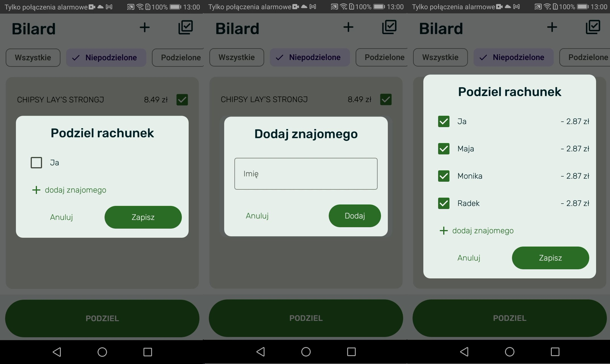

This repository contains data source for my **Bachelor's Degree in IT with specialization in Software Engineering**. 
The topis is 
## Project and implementation of a mobile app to manage shopping based on a receipt
Below there is a full description of the funcionality along with screen shots of the implemented app.

# Description and used tools

  During the development of this engineering project, the main objective was successfully achieved - designing and implementing a mobile application that **enables scanning receipts** and **automatically splitting costs** among participants of a transaction.  
The developed application provides users with a range of features that make it easy and quick to track expenses and distribute costs fairly.  

  The use of the **Kotlin programming language** and the **Room Database** for local data storage ensures high performance and security of stored information.  
The user interface was designed with **Jetpack Compose**, which allowed for an intuitive and user-friendly experience.  

  Some challenges were encountered during the project, but thanks to careful analysis and the use of appropriate technologies, these were successfully resolved.  
One of the interesting aspects was the study of existing market solutions and the identification of gaps that our solution aimed to address.  

  The created application has many advantages, such as the ability to **automatically extract individual products from a scanned receipt**, as well as **splitting shopping costs**.  
The interface is clear and easy to use, allowing for efficient interaction with the app.  
However, like any solution, this application also has certain limitations that may serve as subjects for further work.  
One of the main limitations is the diversity of receipt formats, as layouts of products and prices can vary significantly between different store chains.  
A potential solution could be the use of artificial intelligence to recognize selected sections of receipts.  

The future of the application offers many development opportunities.  
Possible directions include the integration of additional features, such as account registration or connections with external transaction services.  
Another important aspect will be further optimization of performance and adapting the app to future changes in mobile technologies.  

## 4.1.1. Main Application View  

The main view of the **FairPay** application is designed with intuitiveness and aesthetics in mind, offering users a friendly and functional environment for managing group finances.  
The app uses a light, spring-inspired pastel color palette that adds freshness and makes it pleasant to use.  

The home screen is dominated by tiles that provide quick access to the most important features of the app:  
- **Add new receipt** – quickly add a new receipt to the system. Users can scan the receipt and assign it to a specific category.  
- **My receipts** – browse all saved receipts. Users can track their purchases, check details, and manage scanned products.  
- **My friends** – manage your friends list in the app. You can add new contacts, manage existing ones, and monitor each friend’s balance.  

Below the tiles, there is an **expenses balance** section. It shows the balance between the user and their friends, including who owes what. The list is displayed in a clear and readable way, making it easier to track group settlements.  

---

## 4.1.2. Adding a Receipt  

Before scanning a receipt, the user is presented with a category view.  
They must first specify the category where the scanned products will be assigned. A help card at the top of the screen explains how to select or add a new category using the “+” button.  
If there are many categories, the list is scrollable to ensure all are accessible.  

The photo selection view is designed for **convenience and efficiency**.  
Users can either take a photo with their camera or select an existing one from the gallery.  

Key elements include:  
- **Photo source tiles** – choose between camera or gallery.  
- **Cropping instructions** – users are encouraged to crop the photo so that only products are visible, improving OCR recognition for product names and prices.  

The app provides a built-in cropping tool, making it easy to adjust images and remove unnecessary details.  

---

## 4.1.3. Product View and Operations  

After scanning, the user sees a list of products with their prices.  
Products can be selected individually or all at once using a dedicated button.  

At the top, the name of the assigned category is shown, helping users identify which expense category they are managing.  

Filters are available to display products by status:  
- **All** – shows the entire product list  
- **Unassigned** – shows items not yet linked to anyone  
- **Assigned** – shows items already split  

This helps users quickly manage their products and apply different operations based on their status.  

- In **All**, any product can be removed.  
- In **Assigned**, users can also undo the split.  
- For **Unassigned** products, users can edit names and prices (important because OCR, like ML Kit Text Recognition, may not always be 100% accurate).  

---

## 4.1.4. Expense Splitting Module  

This view is dedicated to splitting the cost of selected products among friends.  
It is designed to maximize simplicity and transparency in group settlements.  

- Before pressing **Split**, users must select which products will be shared.  
- By default, the user is included in the split, but they can deselect themselves if they didn’t purchase the item.  
- Friends can be added via a search field.  
- Each participant’s share is automatically calculated and displayed before confirmation, allowing verification and correction.  

---

## 4.1.5. Friends’ Balance Module  

The **Friends’ Balance** field in the main view is the central hub for monitoring and managing settlements.  

Users can:  
- Add new expenses directly to a friend’s balance.  
- Instantly update balances and view how each transaction impacts the overall financial relationship.  
- Add refunds, which automatically adjust the balance and improve transparency in repayments.
  

Inside the **Friends tab**, users can see detailed balance cards showing:  
- All products shared with that friend (name + price).  
- All refunds, clearly marked in context.  

This ensures everyone has full visibility into transactions, obligations, and repayments.  

### Friend Management  
- Users can **edit friend names** (e.g., change to real names or nicknames).  
- Users can **remove friends** from their contact list.  
  - The app asks for confirmation: *“Are you sure you want to remove this friend?”*  
  - Once confirmed, the friend is deleted, useful for cleaning up or ending financial sharing.

